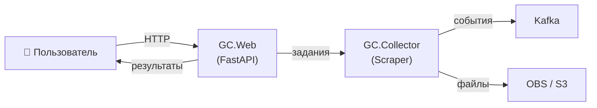
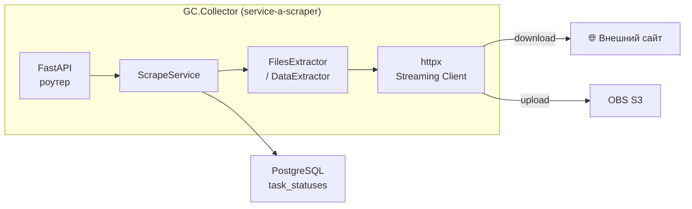

# Architecture rules

## Принципы слоёв

- Route handler содержит только HTTP-логику: десериализацию, валидацию, вызов сервиса, формирование ответа.
- Вся бизнес-логика лежит в service-слое.
- Repository отвечает за доступ к данным (SQLAlchemy-модели, запросы).
- Domain-слой хранит сущности, dataclass'ы, Pydantic-модели и TypeAlias — без зависимостей на инфраструктуру.
- Не допускать смешивания слоёв: сервис не импортирует роутер, роутер не идёт в БД напрямую.
- Избегать over-engineering: добавляй слой только когда он нужен, не из предположений.

## Когда нужен архитектурный документ

Писать `.md`-документ с планом до начала реализации, если задача:

- Добавляет новый компонент (сервис, воркер, интеграция с внешней системой).
- Меняет публичный API или data contract между сервисами.
- Затрагивает схему БД нетривиально (новая таблица, смена типа PK, партиционирование).
- Требует координации двух и более репозиториев.
- Несёт риски производительности или безопасности.

Для задач объёмом > 1 дня — архитектурный документ обязателен.

## C4-диаграммы: правила

Используем **только два верхних уровня**:

| Уровень | Назначение | Обязателен |
|---------|-----------|------------|
| **C1 — Context** | Система в целом + пользователи + внешние системы | Да, всегда |
| **C2 — Container** | Сервисы, базы данных, очереди, хранилища | Да, всегда |
| C3 — Component | Внутренние компоненты одного контейнера | Опционально, если сложная внутрянка |
| C4 — Code | Классы и функции | Не используем в документах |

Диаграммы рисуем в **Mermaid** (`graph LR` или `C4Context`/`C4Container`).

### Шаблон C1 — Context



### Шаблон C2 — Container



## Архитектурные решения (ADR-lite)

Каждое нетривиальное техническое решение фиксировать блоком в разделе документа:

```markdown
### Решение N: <короткое название>

**Выбрано:** <что делаем>
**Альтернативы:** <что рассматривали и почему не взяли>
**Последствия:** <что станет лучше / хуже / какие риски остаются>
```

ADR-lite — это не замена полноценного ADR-файла. Если решение критично (смена фреймворка, хранилища, паттерна взаимодействия) — создавать отдельный ADR через скилл `docs`.

## Python-специфика

- Новый компонент-стратегия → наследовать от существующего базового класса (DataExtractor, BaseRepository и т.п.), не создавать параллельную иерархию.
- Конкурентность: `asyncio.TaskGroup` + `asyncio.Semaphore` для ограничения параллелизма; `multiprocessing.Process` только для CPU-bound или изолированных I/O.
- Retry: `tenacity` с exponential backoff; настройки вынести в `Settings` (pydantic-settings), не хардкодить.
- Лимиты (размер файла, общий объём, кол-во объектов) — именованные константы в `const.py`, задокументированы в архитектурном документе.
- Внешние зависимости (httpx, aioboto3, tenacity) — только если нет готового инструмента в проекте.
