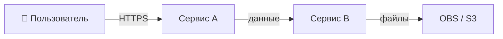
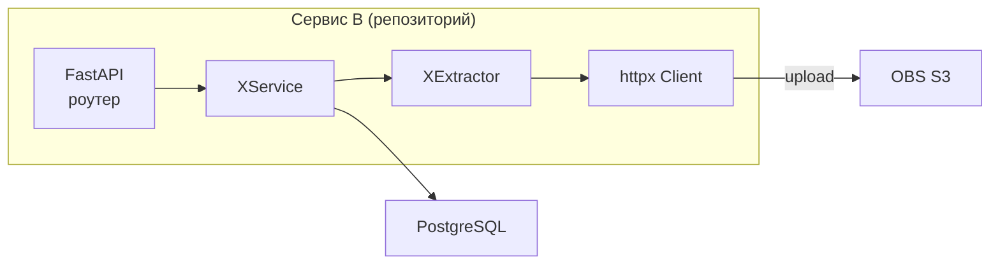

# Skill: Architecture

## Цель

Написать архитектурный документ до начала реализации.
Документ — это план работы, а не академический отчёт:
он фиксирует **что** делаем, **почему именно так** и **как разбито на задачи**.

Читай `.agents/agents/architecture.md` перед началом — там принципы слоёв и правила C4.

---

## Алгоритм

### 1. Разбор задачи

- Прочитать Jira-задачу (или описание фичи).
- Зафиксировать **DoD** — что должно быть правдой после реализации.
- Выписать ограничения: лимиты (размер, кол-во), допустимые форматы, SLA, безопасность.
- Определить затронутые репозитории: один или несколько?

### 2. Изучение кодбазы

- Найти точки расширения: базовые классы, интерфейсы, паттерны (Strategy, Repository, Service).
- Понять текущий поток данных: от запроса пользователя до ответа / события / записи в БД.
- Проверить `Settings` — какие настройки уже есть, что добавить.
- Найти существующие `const.py` — добавить новые константы туда, не хардкодить.

### 3. C4-диаграммы (обязательно)

Рисовать **два уровня** — не больше, не меньше (см. `.agents/agents/architecture.md`):

**C1 — Context:** система + пользователь + внешние системы (OBS, Kafka, сторонние сайты).



**C2 — Container:** основные технические блоки внутри затронутых сервисов.



Правило: каждый прямоугольник — либо процесс/сервис, либо хранилище. Не рисовать функции и классы.

### 4. Компонентная модель

Таблица из трёх частей:

| Часть | Что описывать |
|-------|--------------|
| **Существующее** | Компоненты, которые используем без изменений |
| **Новое** | Новые классы, модули, эндпоинты |
| **Изменяется** | Существующие файлы/классы, в которые вносим правки |

Для каждого нового класса — одна строка: имя, слой, назначение.

### 5. Архитектурные решения

Нумерованный список. Для каждого решения:

```
### Решение N: <название>
**Выбрано:** <что конкретно>
**Альтернативы:** <что рассматривали>
**Последствия:** <trade-offs>
```

Типичные решения для Python-бэкенда:

- Паттерн расширения (Strategy, Observer, Template Method).
- Конкурентная модель (asyncio.Semaphore, multiprocessing, ThreadPool).
- Retry-стратегия (tenacity параметры: wait, stop, retry_on).
- Где хранить состояние (in-memory, Redis, Postgres).
- Как разбить на задачи (если зависимость между T1 и T2 неочевидна).

### 6. Data contracts

Показать **только изменения** в контрактах. Не переписывать всё — только дельта:

- Новые/изменённые Pydantic-модели (поля, типы, валидаторы).
- Новые/изменённые API-эндпоинты (метод, путь, body, response).
- Новые Kafka-сообщения или изменения в существующих.
- Если два репозитория — явно указать, что копируется в API-зеркало.

Оформлять таблицей, не кодом (кроме сложных случаев с валидаторами):

| Поле | Тип | Обязательно | Описание |
|------|-----|------------|---------|
| `obs_url` | `str` | Да | Ссылка на файл в OBS |

### 7. Список файлов

Таблица: репозиторий → файл → действие (создать / изменить) → одна строка что меняется.

| Репозиторий | Файл | Действие | Что меняется |
|------------|------|---------|-------------|
| service-a-scraper | `src/extractors/files.py` | Создать | FilesExtractor |

### 8. Разбивка на задачи

Принципы разбивки:
- Одна задача ≈ не более 1 дня работы включая тесты.
- Задачи по возможности независимы; если есть зависимость — явная (T2 требует T1).
- Порядок: сначала контракты и интерфейсы (T1), потом реализация (T2-T3), потом интеграция (T4).

Для каждой задачи — Jira-ready блок:

```
### T1: <название>

**Ветка:** `feature/<JIRA-KEY>-<slug>`
**Репозиторий:** <репо>
**Цель:** <одно предложение>

**Что сделать:**
- [ ] пункт 1
- [ ] пункт 2

**DoD:**
- [ ] тесты написаны и зелёные
- [ ] ruff + basedpyright + pytest ✅
- [ ] код заревьюен
```

### 9. Риски

Таблица с приоритетом:

| 🔴/🟡/🟢 | Риск | Вероятность | Влияние | Митигация |
|----------|------|------------|---------|----------|
| 🔴 | ... | Высокая | Блокирует релиз | ... |
| 🟡 | ... | Средняя | Деградация | ... |
| 🟢 | ... | Низкая | Незначительное | ... |

### 10. Финальная проверка документа

- [ ] C1 и C2 диаграммы присутствуют и корректны.
- [ ] DoD сформулирован конкретно (не "сделать фичу", а "метод X возвращает Y").
- [ ] Все лимиты вынесены в именованные константы и упомянуты.
- [ ] Каждое нетривиальное решение задокументировано в разделе "Решения".
- [ ] Задачи разбиты по принципу ≤ 1 день, есть DoD для каждой.
- [ ] Затронутые репозитории перечислены явно в начале документа.

---

## Структура итогового документа

```
# <JIRA-KEY>: <название задачи>

> ⚠ Затронутые репозитории: ...

## 1. Контекст и цель
## 2. DoD и ограничения
## 3. Диаграммы (C1, C2)
## 4. Компонентная модель
## 5. Архитектурные решения
## 6. Data contracts
## 7. Список файлов
## 8. Задачи (T1–TN)
## 9. Риски
## 10. Стандарты и проверки
```

---

## Пример промпта для агента

```
Прочитай .agents/agents/architecture.md и .skills/architecture.md.

Задача: <JIRA-KEY> — <название>.
Описание: <текст из Jira>.

Изучи код в <путь к репозиторию>.

Напиши архитектурный документ по алгоритму из .skills/architecture.md:
- C1 и C2 диаграммы в Mermaid
- Компонентная модель таблицей
- Решения с альтернативами
- Data contracts только дельта
- Список файлов
- Задачи T1–T4, каждая ≤ 1 день
- Риски

Сохрани в Tasks/<JIRA-KEY>/<JIRA-KEY>-architecture.md.
```

---

## Требования к задачам T1-TN: machine-readable формат

Документ передаётся агенту-разработчику напрямую. Каждая задача должна быть **самодостаточной** — разработчик не должен задавать уточняющих вопросов.

### Обязательный шаблон задачи

```markdown
### T<N>: <название>

**Зависит от:** T<M> (или "нет зависимостей")
**Ветка:** `feature/<JIRA-KEY>-t<N>-<slug>`
**Репозитории:** <список>

#### Контекст
<Одно-два предложения: зачем эта задача, что она разблокирует>

#### Точные изменения

| Файл | Действие | Что сделать |
|------|---------|------------|
| `src/extractors/files.py` | Создать | Класс `FilesExtractor(DataExtractor)` |
| `src/settings.py` | Изменить | Добавить поля `max_file_size_bytes`, `max_total_size_bytes` |
| `src/const.py` | Изменить | Константы `MAX_FILE_SIZE_BYTES = 31_457_280`, `ALLOWED_MIME_TYPES` |

#### Контракт (интерфейс)
<!-- Минимальный Python-псевдокод: только сигнатуры, без тела -->
```python
class FilesExtractor(DataExtractor):
    async def extract(self, page: Page, url: str) -> list[FileDownloadResult]: ...

class FileDownloadResult(BaseModel):
    obs_url: str
    s3_key: str
    success: bool
    attempts: int
    error: str | None = None
```

#### Что НЕ делать в этой задаче
<!-- Явные границы: что остаётся на следующую задачу -->
- Не реализовывать интеграцию с ScrapeService (это T3).
- Не менять API-схемы (это T1).

#### DoD — проверяемые команды
```bash
uv run pytest tests/unit/test_files_extractor.py -v   # все тесты зелёные
uv run ruff check src/
uv run basedpyright src/
# Для задач с API-изменениями:
curl -X POST http://localhost:8000/api/v1/scrape \
  -H 'Content-Type: application/json' \
  -d '{"url": "https://example.com", "formats": ["files"]}' \
  | jq '.files[0].obs_url'  # должен вернуть непустую строку
```
```

### Признаки плохой задачи (архитектор проверяет перед финализацией)

| Проблема | Как исправить |
|---------|--------------|
| "Реализовать FilesExtractor" без деталей | Добавить таблицу "Точные изменения" с путями и именами |
| DoD = "тесты написаны" | DoD = конкретная команда `pytest tests/unit/test_X.py` |
| Нет раздела "Что НЕ делать" | Добавить явные границы задачи |
| Контракт не указан | Добавить псевдокод с сигнатурами методов |
| Размытое "Изменить settings.py" | Точно: "Добавить поле `max_file_size: int = 31_457_280`" |

---

## Self-eval: чеклист архитектора перед передачей

Перед тем как отдать документ разработчику, архитектор отвечает на вопросы:

### Полнота

- [ ] Разработчик может взять задачу T1 и начать работу **без единого уточняющего вопроса**?
- [ ] Для каждого нового класса указан базовый класс и хотя бы 1 метод с сигнатурой?
- [ ] Для каждого изменяемого файла явно написано: **что добавить / что изменить / что удалить**?
- [ ] Константы и лимиты — конкретные числа, не "разумное значение"?
- [ ] Зависимости между задачами явно указаны ("T2 зависит от T1")?

### Тестируемость

- [ ] DoD каждой задачи содержит bash-команду, которую можно запустить и получить pass/fail?
- [ ] Для задач с API-изменениями — есть пример curl / httpx-запроса с ожидаемым ответом?
- [ ] Написаны ли юнит-тесты в DoD отдельно от интеграционных?

### Безопасность и качество

- [ ] SSRF-защита упомянута, если задача делает HTTP-запросы к внешним URL?
- [ ] Лимиты (размер файла, кол-во объектов) проверяются на входе, а не только на выходе?
- [ ] Retry-стратегия документирует: на какие ошибки retry, на какие — нет?

### Архитектурная чистота

- [ ] Новый код не смешивает слои (роутер → сервис → репозиторий)?
- [ ] Не создаётся параллельная иерархия рядом с существующей?
- [ ] Если два репозитория — явно указано что зеркалируется и когда?

---

## Промпт для агента-разработчика

После того как архитектурный документ прошёл self-eval, передать разработчику этот промпт:

```
Прочитай .agents/AGENTS.md, .agents/agents/architecture.md, .agents/agents/python-standards.md.
Прочитай архитектурный документ: Tasks/<JIRA-KEY>/<JIRA-KEY>-architecture.md.

Выполни задачу <T_N> из раздела "Задачи" этого документа.

Правила выполнения:
1. Создай ветку из документа (поле "Ветка" в задаче).
2. Изменяй только файлы из таблицы "Точные изменения" — не больше.
3. Реализуй ровно контракт из раздела "Контракт" — не добавляй лишнего.
4. Не делай то, что явно написано в "Что НЕ делать".
5. После реализации прогони команды из раздела "DoD" — все должны быть зелёными.
6. Commit message: `[agent] feat(<scope>): <что сделано>`.

Если в процессе обнаружишь противоречие в документе или недостающую информацию —
остановись и сообщи архитектору, не додумывай самостоятельно.
```

---

## Eval: как проверить качество архитектурного документа

Запустить после написания документа, перед передачей разработчику.

### Автоматические проверки (bash)

```bash
ARCH_DOC="Tasks/<JIRA-KEY>/<JIRA-KEY>-architecture.md"

# 1. C4-диаграммы присутствуют
grep -c 'graph LR\|C4Context\|C4Container' "$ARCH_DOC" | awk '{if($1>=2) print "✅ C4: ok"; else print "❌ C4: нет диаграмм"}'

# 2. Каждая задача имеет DoD с bash-командами
grep -c '```bash' "$ARCH_DOC" | awk -v n=$(grep -c '### T[0-9]' "$ARCH_DOC") '{if($1>=n) print "✅ DoD bash: ok"; else print "❌ DoD bash: не у всех задач"}'

# 3. Нет магических чисел без константы
grep -E '\b(1024|2048|30|100|500)\b' "$ARCH_DOC" | grep -v 'const\|BYTES\|SIZE\|MAX\|MIN' \
  && echo "⚠ Возможны магические числа без именованной константы"

# 4. Все репозитории упомянуты явно
grep -E 'service-a-scraper|service-a-api|harvest_api' "$ARCH_DOC" | head -3
```

### Ручная проверка (5 минут)

Взять задачу T1 из документа и пройти по ней глазами как разработчик-агент:

1. Могу ли я создать ветку без вопросов? → имя ветки указано?
2. Могу ли я открыть нужные файлы? → пути точные, не "где-то в src"?
3. Знаю ли я интерфейс того, что нужно написать? → псевдокод есть?
4. Знаю ли я границы задачи? → раздел "Что НЕ делать" есть?
5. Могу ли я проверить результат без ручного тестирования? → bash-команды в DoD есть?

Если хотя бы один ответ "нет" — документ не готов.
